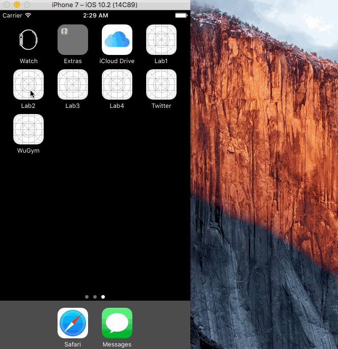

# Pet Game
University Mobile App Dev Class - Lab 2 & 5

Submitted by: Reis Sirdas

## Extra Features (Creative Portion)

1) Animated Death! Yay!

2) Added audio with AVFoundation, plays designated pet sound after creating or switching to a pet, and also when it dies

3) Added data persistence with Core Data by subclassing the Pet class to NSManagedObject so pets (dead or alive) are saved between app launches, added ability to give pets names (and save it), also can click on pet name to change it

## Video Walkthrough 

Here's a walkthrough:

GIF created with [LiceCap](http://www.cockos.com/licecap/).
